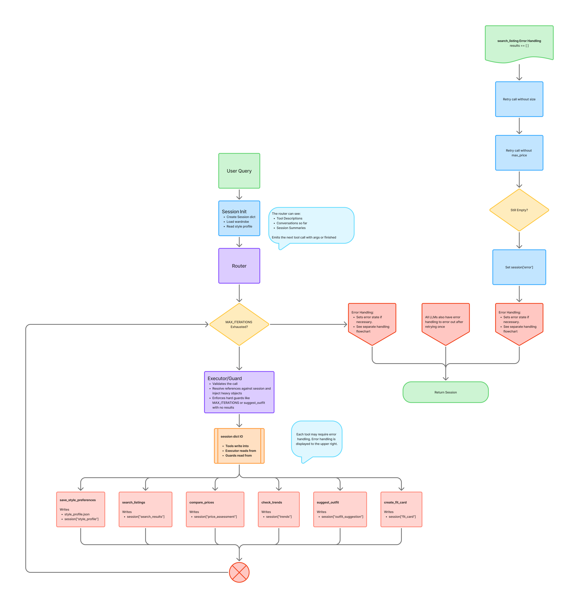
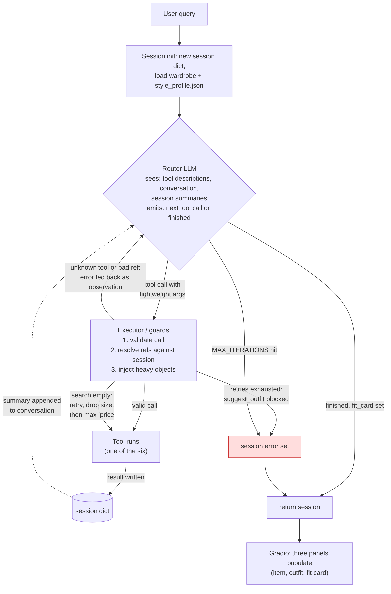
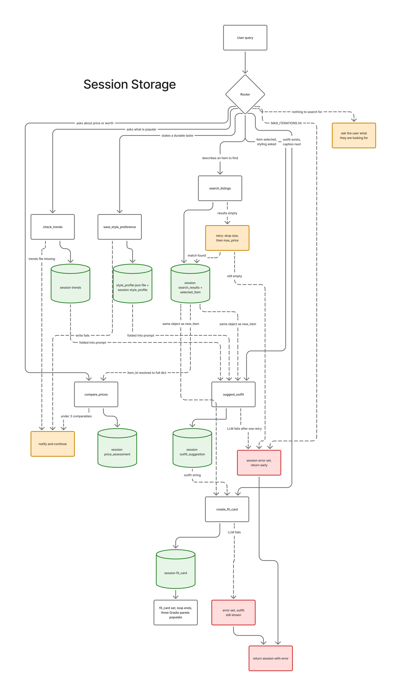
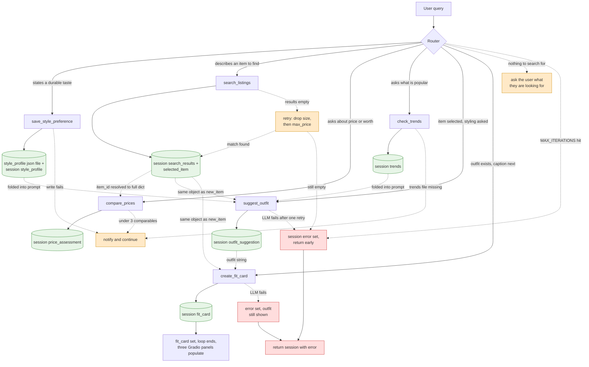

# FitFindr — planning.md

---

## Tools

### Tool 1: search_listings

**What it does:**
The `search_listings` tool searches the listings data for items matching the given criteria. It returns a list of matching items, sorted by relevance score, best match first.

Scoring is a keyword overlap. Each listing's `title`, `description`, `style_tags`, `colors`, `category`, and `brand` are joined into one lowercase haystack string, and the score is the count of query words that hit. `brand` may be `null` and is skipped when missing. Listings with a score of 0 are dropped.

Size matching is case-insensitive and token-based. The listing's size string is split on `/`, spaces, and parentheses, and the requested size must equal one of the tokens, so "M" matches "S/M" and "M/L" but "L" does not match "XL". Listings marked "One Size" match any requested size. Sizes span letter sizes, shoe sizes ("US 8"), and waist sizes ("W30"). Matching is string-based, no numeric conversion.

If nothing is found, the tool returns an empty list.

**Input parameters:**
- `description` (`str`): A description of the item to search for.
- `size` (`str` | `None`): The size of the item to search for.
- `max_price` (`float` | `None`): The maximum price of the item to search for.

**What it returns:**
A list of dictionaries, each representing a matching item. Each dictionary contains the following fields:
- `id` (`str`): Unique identifier for the item, such as "lst_040"
- `title` (`str`): The title of the item.
- `description` (`str`): A short description of the item, listing features such as colors and style .
- `category` (`str`): The category of the item, such as "tops" or "accessories"
- `style_tags` (`list[str]`): Tags describing the item's style, such as "vintage" and "cottagecore"
- `size` (`str`): String representation of the item's size, such as "L/XL"
- `condition` (`str`): string representation of the item's condition,
- `price` (`float`): The price of the item.
- `colors` (`list[str]`): A list of strings representing the item's colors.
- `brand` (`str` | `null`): The brand of the item, such as "Levi's" or `null` if unknown.
- `platform` (`str`): The platform the item is available on, such as "depop", "thredUp", or "poshmark"

**What happens if it fails or returns nothing:**
An empty list is returned if no items match the criteria. There is nothing else to handle. `search_listings` makes no LLM or network calls, it is pure local computation over `listings.json`. The only other failure is the data file being missing or corrupt, which kills the app at startup, not mid-session. The agent-level response to an empty list is the two-stage retry described in the Planning Loop and Error Handling sections.

**Breakdown of Listings**

- id:           lst_001…lst_040, all unique
- title:        Unique short names, no duplicates
- description:  95–141 chars, never empty — the richest text for keyword scoring
- category:     Exactly the 5 the README claims: tops 15, bottoms 10, outerwear 8, shoes 4, accessories 3
- style_tags:   List of 4–5 per listing, 45 distinct, all lowercase. Top: vintage (29), classic (16), streetwear (15), earth tones (11), cottagecore (9), grunge (8), 90s (8), y2k (7)
- size:         The 22-format zoo we covered (letters, combos, US shoe, waist)
- condition:    Only good (19) / excellent (17) / fair (4)
- price:        All floats, $12.00–$75.00                                                                                   
- colors:       List per listing, 38 distinct, lowercase, includes multi-word ("forest green", "faded black")
- brand:        32/40 null (covered earlier)
- platform:     depop (18), thredUp (11), poshmark (11)
  

**Breakdown of Wardrobe Items**

- schema — wardrobe items have exactly: id, name, category (same 5 values), colors (list), style_tags (list), notes (optional string).
- example_wardrobe — 10 items, deliberately curated to pair with the listings: baggy dark-wash jeans, chunky white sneakers, black combat boots, denim jacket… your demo query ("baggy jeans and chunky sneakers") maps directly onto w_001 and w_007. The suggest_outfit prompt should name
these pieces.
- empty_wardrobe — {"items": []} plus a _note key. Code should only ever touch items.

Two traps here:
1. notes is null on 5 of 10 items — with the same None-guard issue as brand. When formatting wardrobe items into the LLM prompt, we should skip or default null notes.
2. Wardrobe items have no size or price — so suggest_outfit's prompt is built from name/category/colors/tags/notes only. We shouldn't spec fields that don't exist.

---

### Tool 2: suggest_outfit

**What it does:**
Suggests 1-2 complete outfits based on a user's wardrobe and a thrifted item they're looking for.

**Input parameters:**
- `new_item` (`dict`): A listing dictionary describing the item the user is looking for.
- `wardrobe` (`dict`): A dictionary representing the user's wardrobe.
- `style_profile` (`list[str]` | `None`, optional): Saved preferences loaded from `data/style_profile.json`, injected by the executor when present (stretch: Style Profile Memory).
- `trends` (`list[dict]` | `None`, optional): Trend data from `check_trends`, injected by the executor when available (stretch: Trend Awareness). Both optional parameters default to `None` and the prompt simply omits them when absent.

**What it returns:**
The tool returns a non-empty string representing the suggested outfit. If the wardrobe is empty, the tool returns general styling advice for the item instead. 

**What happens if it fails or returns nothing:**
If the wardrobe is empty (wardrobe['items'] is []), the tool does not fail — it prompts the LLM for general styling advice for the item instead of wardrobe-specific outfits, and the agent continues to create_fit_card. 

If the LLM call errors or returns an empty string, the tool returns/raises a detectable failure, the agent sets session["error"] to a message naming the item and suggesting a retry, and ends the interaction early without calling create_fit_card.

---

### Tool 3: create_fit_card

**What it does:**
Generates a short, shareable outfit caption for the thrifted item.

**Input parameters:**
- `outfit` (str): The outfit suggestion string returned by `suggest_outfit()`
- `new_item` (dict): The listing dictionary for the thrifted item. (See breakdown above in `search_listings()`)

**What it returns:**
The tool returns a string of 2-4 sentences in the style of an Instagram/TikTok caption, mentioning the item name, price, and platform once each. Output varies run to run for the same input, enforced with a higher LLM temperature.

**What happens if it fails or returns nothing:**
If an outfit is missing or empty, a descriptive error message string is returned, but will not throw an exception.

If the LLM call itself errors, the tool returns a detectable failure the same way `suggest_outfit` does. The agent sets `session["error"]` but still shows the outfit suggestion, so the user keeps the styling work even when the caption fails.

---

### Tool 4: compare_prices

**What it does:**

Given an item, it estimates whether the price is fair based on comparable listings in the dataset. Comparables are listings in the same `category` that share at least one `style_tag` with the item. If that yields fewer than 3, it falls back to the whole category. The item's price is placed against the comparable price range to produce a verdict. Pure local computation, no LLM call.

**Input parameters:**

- `item_id` (`str`): The id of the listing to assess, such as "lst_017". The executor resolves it to the full listing dict from `session["search_results"]`.

**What it returns:**

A dict containing:
- `verdict` (`str`): One of "below market", "fair", or "above market"
- `item_price` (`float`): The price of the assessed item
- `comparable_count` (`int`): How many comparables the verdict is based on
- `comp_min` / `comp_median` / `comp_max` (`float`): Price stats across the comparables
- `reasoning` (`str`): One human-readable sentence, such as "At $22 this band tee sits below the $28 median of 6 comparable vintage tops."

**What happens if it fails or returns nothing:**

If fewer than 3 comparables exist even after the category fallback, the verdict is "not enough data" and `reasoning` says so. The agent relays that price fairness couldn't be assessed for this item and continues the flow. This tool never blocks the core chain.

### Tool 5: check_trends

**What it does:**

Surfaces which styles are currently popular by reading `data/trends.json`, a bundled snapshot of tag activity styled as a fashion-platform feed (the documented data source, with the interface written so a live API could swap in). Results can be narrowed to a category and cross-referenced against the user's size so trends are only surfaced when something matching is actually in stock.

**Input parameters:**

- `category` (`str` | `None`): Limit trends to one listing category, such as "tops". `None` returns trends across all categories.
- `size` (`str` | `None`): The user's size. When provided, each trend reports how many in-stock listings match both the trend and the size. `None` skips the stock check.

**What it returns:**

A list of up to 5 trend dicts, sorted by popularity. Each contains:
- `tag` (`str`): The trending style tag, such as "gorpcore" or "cottagecore"
- `mentions` (`int`): Post count for the tag in the snapshot week
- `momentum` (`float`): Week-over-week change, such as 0.4 for up 40 percent
- `in_stock` (`int`): Number of listings carrying this tag that match the user's size, `0` if `size` was `None`

**What happens if it fails or returns nothing:**

Trend data is flavor, never load-bearing. If `trends.json` is missing or unreadable, or no trends match the category, the tool returns an empty list and the agent proceeds with a normal outfit suggestion, noting that trend data was unavailable. This tool never blocks the core flow.

---

### Tool 6: save_style_preference

**What it does:**

Persists a style preference the user states during a conversation, appending it to `data/style_profile.json` (stretch: Style Profile Memory). The router calls it when the user expresses a durable taste, such as "I'm really into grunge lately" or "never show me pink." Saving is the only tool. Reading is automatic, the executor loads the profile at session start and injects it into the `suggest_outfit` prompt the same way it injects the wardrobe.

**Input parameters:**

- `preference` (`str`): A short preference statement, such as "loves grunge" or "dislikes pink".

**What it returns:**

The updated list of saved preferences (`list[str]`), so the router can confirm to the user what is now remembered.

**What happens if it fails or returns nothing:**

If the file cannot be written, the tool returns a descriptive error string instead of raising. The agent tells the user the preference couldn't be saved this time and continues the session normally. A failed write never affects the current interaction. On the read side, if `style_profile.json` is corrupt or unreadable at session start, the executor treats it as an empty profile and continues.

---

## Planning Loop

**How does your agent decide which tool to call next?**
The agent is a ReAct-style router loop. Each iteration, the LLM receives the tool descriptions (name, input signature, output type), the conversation so far, and the session state, and chooses the next tool call or signals that it's finished. Tool results are appended to the session and fed back in. 

The router's choices are bounded by hard guards in code, starting with a `MAX_ITERATIONS` cap. If `search_listings` returns an empty list, the router retries up to two times, first with the `size` filter removed, then with the `max_price` cap removed, telling the user what was adjusted each time (stretch feature: Retry Logic with Fallback). If the retries also return nothing, the loop blocks any call to `suggest_outfit`, sets `session["error"]` to a message naming what was tried and what to change, and exits.

The three optional tools never gate the core chain. After a successful search, the router may call `compare_prices` (when the query asks about price or worth) and `check_trends` (to enrich the suggestion). `save_style_preference` fires whenever the user states a durable taste. Results from all three land in the session, and the executor folds the style profile and trend data into the `suggest_outfit` prompt.

The loop terminates when `fit_card` is set (success) or `error` is set (early exit). Query understanding happens in the same router call when the LLM extracts `description`/`size`/`max_price` for `search_listings` itself, passing `None` for anything the user didn't mention, and `search_listings` skips `None` filters.

---

## State Management

**How does information from one tool get passed to the next?**
There are two layers to the state. The first is the session state, found in `_new_session()` containing:
- `query` (`str`): The user's query.
- `parsed` (`dict`): parsed query from LLM
- `search_results` (`list[dict]`): List of matching listings.
- `selected_item` (`dict`): The item the user selected from the search results.
- `wardrobe` (`dict`): The user's wardrobe.
- `style_profile` (`list[str]`): Saved preferences loaded from `data/style_profile.json` at session start.
- `trends` (`list[dict]`): Trend data returned by `check_trends`, empty until called.
- `price_assessment` (`dict` | `None`): The verdict returned by `compare_prices`, `None` until called.
- `outfit_suggestion` (`str`): The outfit suggestion string returned by `suggest_outfit()`.
- `fit_card` (`str`): The outfit caption string returned by `create_fit_card()`.
- `error` (`str`): If an error occurs, this is set to a message describing the error.
- `iterations` (`int`): Router iteration counter, checked against `MAX_ITERATIONS`.
- `tool_log` (`list`): Record of tool calls made, for debugging and the demo.

Every tool call updates the session state. The second layer is the router's message history. Tool results are summarized back into the conversation so the LLM can see what came back and choose the next move, but heavy objects stay in the session.

State passes between tools through the session, not through the LLM: 
- the router selects tools and supplies only lightweight references (e.g., item_id: "lst_017")
- the executor layer resolves those references against the session and injects the full objects 

The actual listing dict comes from `session["search_results"]`, the wardrobe from `session["wardrobe"]`, the outfit string from `session["outfit_suggestion"]`. Heavy data never round-trips through the LLM, so the item returned by `search_listings` is guaranteed to be the same object passed into `suggest_outfit`, with no re-entry by the user and no transcription by the model.

The session is also what the guard conditions read: empty `search_results` blocks `suggest_outfit` and sets `error`. A populated `fit_card` ends the loop.

The only state that survives a session is `data/style_profile.json`. Everything else lives in the session dict and dies with it.

---

## Error Handling

For each tool, describe the specific failure mode you're handling and what the agent does in response.

| Tool                  | Failure mode                                                                                                            | Agent response                                                                                                                                                                                                                                                                                                                                                                                                                                                                                                                                                                        |
|-----------------------|-------------------------------------------------------------------------------------------------------------------------|---------------------------------------------------------------------------------------------------------------------------------------------------------------------------------------------------------------------------------------------------------------------------------------------------------------------------------------------------------------------------------------------------------------------------------------------------------------------------------------------------------------------------------------------------------------------------------------|
| search_listings       | No results match the query                                                                                              | The agent retries automatically, up to twice, loosening one filter at a time. The first retry removes the `size` filter, the second removes the `max_price` cap. Each retry tells the user what was adjusted, such as "Nothing matched in size XXS under \$5, so I searched again without the size filter." If all retries return nothing, the agent exits with a specific message, such as "No matches for 'designer ballgown' even with all filters loosened. The cheapest item in stock is $12. Try a different description." `suggest_outfit` is never called with empty results. |
| suggest_outfit        | Wardrobe is empty                                                                                                       | The agent will respond with general styling advice and continue. For instance, 'A navy blue hat as you described will go great with solid colors, especially something lighter like white'                                                                                                                                                                                                                                                                                                                                                                                            |
| create_fit_card       | Outfit input is missing or incomplete                                                                                   | The guard prevents this case. `create_fit_card` is only callable when `session["outfit_suggestion"]` is a non-empty string. If it is somehow called without one, the tool returns a descriptive error string instead of raising an exception. The agent then sets `session["error"]` and tells the user, "I found your item and styled it, but couldn't generate the caption. Here is the outfit suggestion, and you can re-run for a fit card."                                                                                                                                      |
| compare_prices        | Fewer than 3 comparable listings                                                                                        | The verdict comes back "not enough data" with `reasoning` saying so. The agent relays that price fairness couldn't be assessed for this item and continues the flow normally.                                                                                                                                                                                                                                                                                                                                                                                                         |
| check_trends          | `trends.json` missing, unreadable, or no matching trends                                                                | The tool returns an empty list. The agent proceeds with a normal outfit suggestion and notes that trend data was unavailable. Never blocks the core flow.                                                                                                                                                                                                                                                                                                                                                                                                                             |
| save_style_preference | Profile file cannot be written                                                                                          | The tool returns a descriptive error string instead of raising. The agent tells the user the preference couldn't be saved this time and continues the session.                                                                                                                                                                                                                                                                                                                                                                                                                        |
| router / executor     | Any LLM call fails (Groq error, timeout, or rate limit). Applies to the router, `suggest_outfit`, and `create_fit_card` | Catch, wait briefly, retry once. If it still fails, set `session["error"]` to "The styling service is busy, try again in a moment" and preserve whatever the session already holds, such as search results or an outfit.                                                                                                                                                                                                                                                                                                                                                              |
| router / executor     | Router names a tool that doesn't exist or supplies a bad reference, such as an `item_id` not in `search_results`        | The executor validates every call before running it. Invalid calls are never executed. The error is fed back into the conversation as an observation so the router can self-correct on the next iteration. The failed attempt still counts toward `MAX_ITERATIONS`.                                                                                                                                                                                                                                                                                                                   |
| router / executor     | `MAX_ITERATIONS` exhausted without `fit_card` or `error` set                                                            | Exit with an error message saying what was accomplished, and show partial results. If an outfit exists but no caption, the user still gets the outfit.                                                                                                                                                                                                                                                                                                                                                                                                                                |
| router / executor     | Parsed `description` is empty, the query has nothing to search for (such as "hey")                                      | `search_listings` is never called. The agent asks what the user is looking for and gives an example query.                                                                                                                                                                                                                                                                                                                                                                                                                                                                            |

---

## Stretch Notes

All four stretch features are committed. Each one ships as implement, demonstrate, and document in one unit.

- **Retry Logic with Fallback (+1).** On zero results the router retries up to twice, loosening one constraint at a time, `size` first, then `max_price`, telling the user what was adjusted each time. Hard cap via `MAX_ITERATIONS`. Canonical in the Planning Loop section above.
- **Price Comparison Tool (+2).** `compare_prices`, specced as Tool 4 above. Evidence: demo or source showing an assessment with reasoning, plus a README section describing how comparisons are made.
- **Style Profile Memory (+2).** A `data/style_profile.json` file. Reads are automatic, the executor loads it at session start and injects it into the `suggest_outfit` prompt like the wardrobe. Writes go through one router-visible tool, `save_style_preference(preference)`, specced as Tool 6 above. Evidence: the demo shows the save in interaction one and the recall in interaction two, from a fresh session.
- **Trend Awareness Tool (+2).** `check_trends`, specced as Tool 5 above. Data source is a bundled `data/trends.json` snapshot styled as a fashion-platform feed, with the interface written so a live API could swap in. No external API at runtime. Evidence: demo showing trend info visibly influencing the outfit suggestion, plus a README section naming the data source.

[//]: # (TODO: author trends.json on build day from tags that exist in the dataset, plus a couple that don't, so the demo can show an in_stock: 0 trend not being pushed)

---

## Architecture

**Overall (Image):**

**Overall Mermaid Diagram:**

**Session (Image):**

**Session Mermaid Diagram:**

---

## AI Tool Plan

**Milestone 3 — Individual tool implementations:**

AI tool: Claude (Claude Code).

For each of the six tools, one at a time, I'll give Claude that tool's spec block from this document (what it does, inputs, return value, failure behavior) and ask it to implement the function in `tools.py`, using `load_listings()`, `get_example_wardrobe()`, and `get_empty_wardrobe()` from `utils/data_loader.py` rather than re-implementing file loading. The LLM-backed tools (`suggest_outfit`, `create_fit_card`) use Groq `llama-3.3-70b-versatile` with the key from `.env`. I expect back one function per ask, matching the specced signature exactly.

Before trusting any generated function I'll review it against its spec block: does it take the parameters I defined, return the structure I described, and handle the failure mode in the spec. Specific checks I already know matter from the data analysis:
- `search_listings` must skip null brands (32/40 listings have `brand: null`) and must not match "L" to "XL", per the token-based size matching in Tool 1.
- `suggest_outfit` must not crash on `wardrobe["items"] == []` and must skip null `notes` when formatting wardrobe items into the prompt.
- `create_fit_card` must return varied output across runs for the same input.

Each tool then gets pytest cases in `tests/test_tools.py`, at least one per failure mode, and all tests pass before I move to Milestone 4.

**Milestone 4 — Planning loop and state management:**

AI tool: Claude again.

Input: the Planning Loop section, the State Management section, the Error Handling table, and the Architecture diagram from this document.

I expect back the router loop in `agent.py`: a Groq function-calling loop with the executor layer that validates every tool call, resolves lightweight references against the session dict, injects the heavy objects, and enforces the hard guards (`MAX_ITERATIONS`, no `suggest_outfit` on empty results, no `create_fit_card` without an outfit).

Verification is behavioral, straight from the Error Handling table:
- The happy-path demo query produces search, then outfit, then fit card, with `session["selected_item"]` being the same object passed into `suggest_outfit`.
- The impossible query ("designer ballgown, XXS, under $5") produces the two-stage retry, then a specific error, and never calls `suggest_outfit`.
- A hallucinated tool call or bad `item_id` is fed back as an observation, never executed.
- An empty parsed description asks the user for more instead of searching.

I'll run `python agent.py` for both built-in test cases and read `session["tool_log"]` to confirm the two sequences differ before wiring `handle_query()` in `app.py`.

---

## A Complete Interaction (Step by Step)

Write out what a full user interaction looks like from start to finish — tool call by tool call. Use a specific example query.

**Example user query:** "I'm looking for a vintage graphic tee under $30. I mostly wear baggy jeans and chunky sneakers. What's out there and how would I style it?"

**Setup:**

At the beginning of the session, the executor loads the `style_profile`  data. This is before the user query.

**Step 1:**

First, the user enters a message to the agent, who then parses and understands the query. The agent will grab descriptions of tools and decide what information they have and what information is needed to make the call. 

Example: "I'm looking for a vintage graphic tee under $30. I mostly wear baggy jeans and chunky sneakers. What's out there and how would I style it?"

**Step 2:**
The agent makes the first call after parsing the query which contained a style taste ("mostly wear baggy jeans and chunky sneakers"). The tool will be the `save_style_preference` tool with a preference of 'streetwear'. The tool itself writes and updates `session['style_profile']` and will persist throughout the interaction and into the next, perpetually.

**Step 3:**
The previous step results in a list of style preferences, which the model uses to ensure alignment with the agent, and continues. The agent then makes a call to `search_listings` with the `description` (`vintage graphic tee`), `size` (`None`) and `max_price` (`30.0`) filters. The results are written to `session['search_results']` to be processed by the next tool.

**Step 4:**
The agent makes a call to `suggest_outfit` with the item from the session, the wardrobe, as well as `session["style_profile"]` and `trends`. This will return a string representing the suggested outfit. If the wardrobe is empty, the model will return general style advice. (This query has no trend requests inherently, but others may)

**Step 5:**
The agent calls `create_fit_card` with the outfit from the previous step and the item queried to the user. This returns a string of 2-4 sentences in the style of an Instagram/TikTok caption. The message will mention the item name, price, and platform. Output will vary run to run on the same input.  

**Final output to user:**
The router signals finished, `fit_card` is set, the loop ends, and the user sees all three panels in the gradio interface populated, ending on the caption built from the very item the search found.